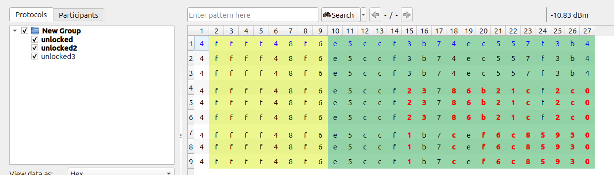
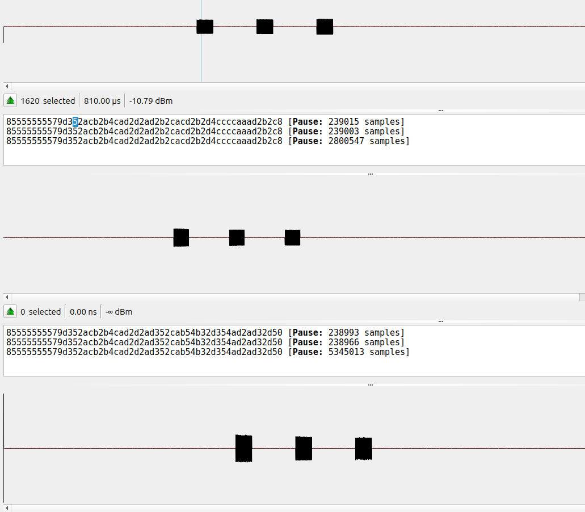

Here i have recorded 3 instances of trying to unlock the car.

Instance 1: column 1 - 3 | 
Instance 2: column 4 - 6 | 
Instance 3: column 7 - 9

From the screenshot we can see that the first 14 rows are predefined, and stays the same. The rows from 15 - 27 seems to be different from each of the instances. Note that row 17 seems to be the same; this could either be completely random or on purpose, needs further testing to know that for a fact. 

What is interesting here is that the car key seems to always be sending 3 waves of signals every time, doens't matter if you hold the car key down for a long or short time. It is consistent with sending 3 waves.

What we found out (problem):

We can't replay the same frequency of trying to unlock the car twice. Meaning that if we just simply record the frequency of the car key trying to unlock the car, then we can't do a replay attack of what we just recorded. 

Theory (what i think):

The car has some sort of logic to know which frequency it's supposed to recieve, meaning that it already knows what the rows 15 - 27 is supposed to be, the next time we try to unlock the car with the car key. Im not sure if this is randomly generated as that means the car and the car key has to communicate in some sort of way before the car key sends the next frequency, and i cannot tell that from what ive seen from the frequencies just yet. 

My guess is that the car and the car keys has some sort of algorithm that rotates everytime the car key has been pressed, so that both the car keys knows what to send, and the car itself only accepts the frequency it's about to recieve. <-- No! Because in fact we have two car keys, and if we use one of them, then how would the other key know that it has been used? 

Ways to hack (my theory):

1. The hardest way is to find out the patterns that are used in the row 15 - 27. I have not attempted it, but i would assume that it would be hard to replicate. 

2. You can jam the frequency so that the car doesn't get the unlock message from the car key, then we can spoof the frequencies. Meaning that we recieve it from the car key, without the car knowing. Then we can send it instead.

Problems with ways to hack:

1. A big potentional problem here is that the HackRF can't jam a frequency and recieve at the same time, as it's half-duplex.

2. Another problem would be if the logic of the car and the car keys are based on an algorithm that botht he car keys and the car calculates, then if we either calculate the next frequency then use it. Then the car keys could potentionally be broken as they now will send a message that already been sent. Best case you just press the car key twice and its solved. Worst case it's always one behind and can't figure out the next frequency that is accepted

Bonus:

It would be cool to know if the first 14 rows is the unique identifier for our car specifically, that seems logical to me as if you would have 2 identical cars next to eachother then you would need an identifier to differ from the two. 